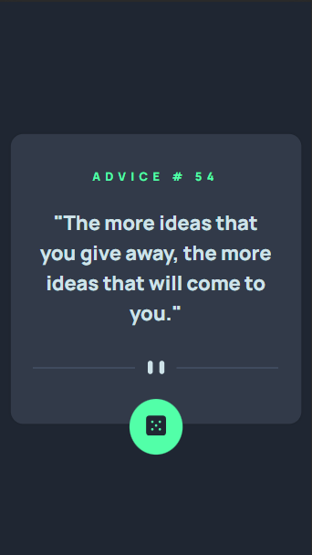
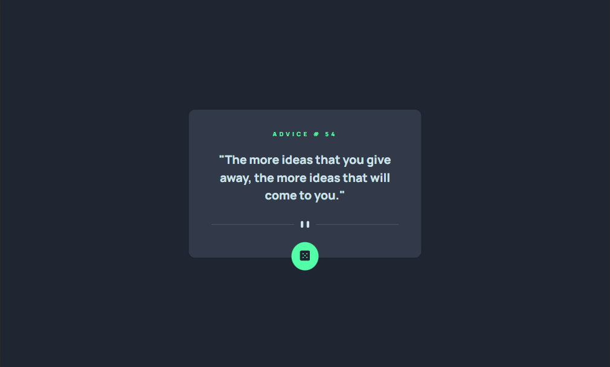
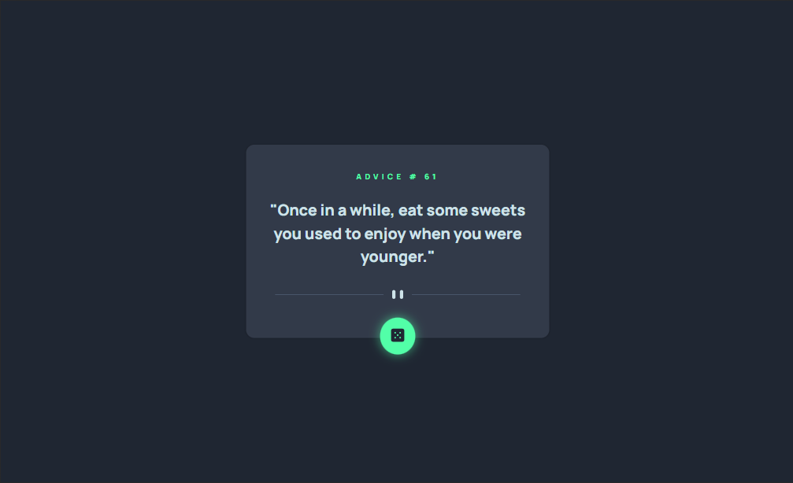

# Frontend Mentor - Advice generator app solution

This is a solution to the [Advice generator app challenge on Frontend Mentor](https://www.frontendmentor.io/challenges/advice-generator-app-QdUG-13db). Frontend Mentor challenges help you improve your coding skills by building realistic projects.

## Table of contents

- [Overview](#overview)
  - [The challenge](#the-challenge)
  - [Screenshot](#screenshot)
  - [Links](#links)
- [My process](#my-process)
  - [Built with](#built-with)
  - [What I learned](#what-i-learned)
  - [Continued development](#continued-development)
  - [Useful resources](#useful-resources)
- [Author](#author)

## Overview

### The challenge

Users should be able to:

- View the optimal layout for the app depending on their device's screen size
- See hover states for all interactive elements on the page
- Generate a new piece of advice by clicking the dice icon

### Screenshot





### Links

- Solution URL: [solution url](https://stupendous-syrniki-f3d152.netlify.app/)

## My process

### Built with

- Semantic HTML5 markup
- CSS custom properties
- Flexbox
- Desktop-first workflow
- Javascript
- fetch api

### What I learned

I learned how to center a div anew. The CSS for achieving this is provided below. Additionally, I revisited the process of fetching data using the Fetch API and displaying that data on the client.

```css to center a div
.card {
  position: absolute;
  top: 50%;
  left: 50%;
  transform: translate(-50%, -50%);
  display: flex;
  flex-direction: column;
  align-items: center;
}
```

### Continued development

I plan to tackle more challenges, particularly those related to retrieving data from APIs.

### Useful resources

- [Web Dev Simplified](https://youtu.be/cuEtnrL9-H0?si=e8s8Uy-6VJ8ejKq1) - This amazing tutorial helped me remember the basics of fetch api.

- [chat GPT](https://chat.openai.com/) - I encountered a challenge while attempting to display API data on the client side. Fortunately, ChatGPT provided valuable assistance, helping me overcome the obstacle.

## Author

- Website - [Anthony Mwaura](https://github.com/Anthony11-hub)
- Frontend Mentor - [@Anthony11-hub](https://www.frontendmentor.io/profile/Anthony11-hub)
- Twitter - [@Anthony11hub](https://www.twitter.com/Anthony11hub)
