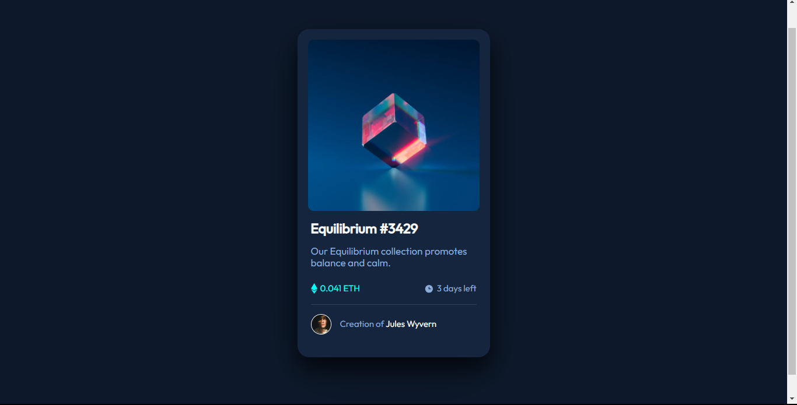
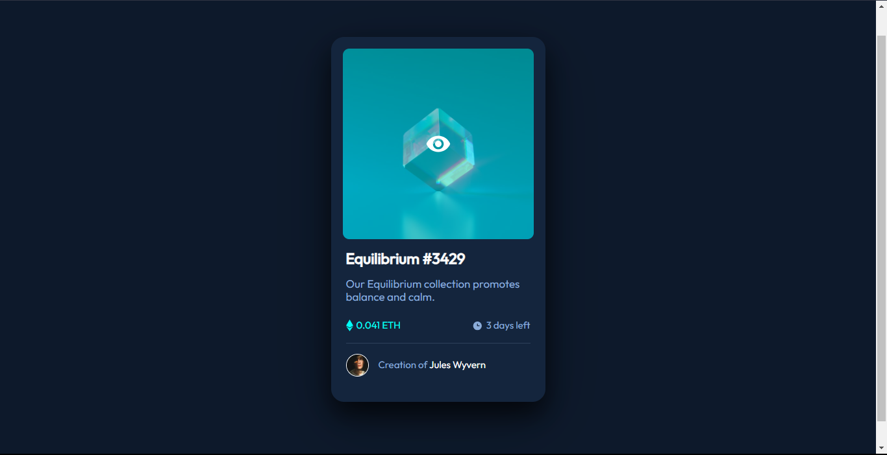

# Frontend Mentor - NFT preview card component solution

This is a solution to the [NFT preview card component challenge on Frontend Mentor](https://www.frontendmentor.io/challenges/nft-preview-card-component-SbdUL_w0U). Frontend Mentor challenges help you improve your coding skills by building realistic projects.

## Table of contents

- [Overview](#overview)
  - [The challenge](#the-challenge)
  - [Screenshot](#screenshot)
  - [Links](#links)
- [My process](#my-process)
  - [Built with](#built-with)
  - [What I learned](#what-i-learned)
  - [Continued development](#continued-development)
  - [Useful resources](#useful-resources)
- [Author](#author)

## Overview

### The challenge

Users should be able to:

- View the optimal layout depending on their device's screen size
- See hover states for interactive elements

### Screenshot

### Links

- Solution URL: [Add solution URL here](https://your-solution-url.com)
- Live Site URL: [Add live site URL here](https://your-live-site-url.com)

## My process

### Built with

- Semantic HTML5 markup
- CSS custom properties
- Flexbox
- Desktop-first workflow

### What I learned

I have learned more about how Flexbox works.

### Continued development

I will continue practicing by building projects on Frontend Mentor to deepen my understanding of CSS. I'm also looking forward to getting into Tailwind CSS later on, especially when I start relearning React.

### Useful resources

- [Chat GPT](https://chat.openai.com/) - Helped me understand how to align the svg images with their p tag elements.

## Author

- Website - [Anthony Mwaura](https://github.com/Anthony11-hub)
- Frontend Mentor - [@Anthony11-hub](https://www.frontendmentor.io/profile/Anthony11-hub)
- Twitter - [@Anthony11hub](https://www.twitter.com/Anthony11hub)
