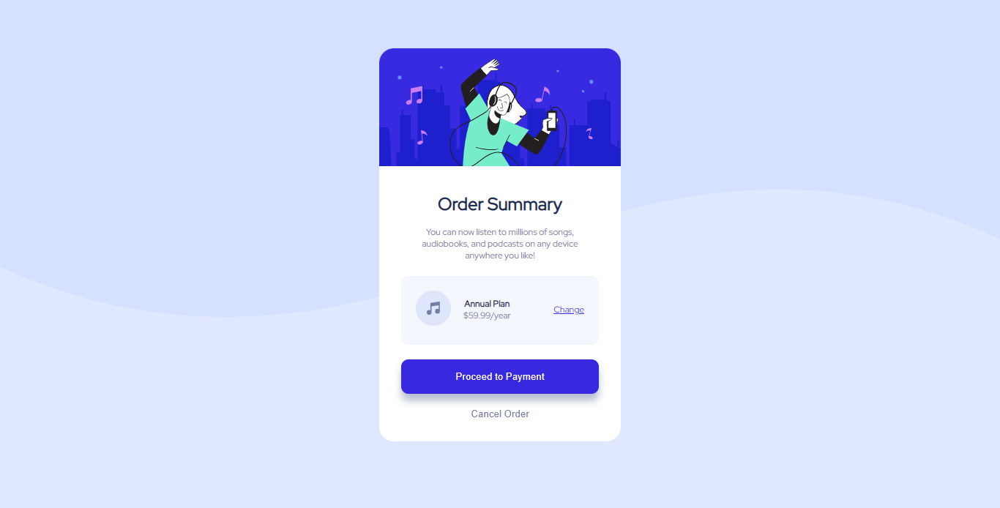

# Frontend Mentor - Order summary card solution

This is a solution to the [Order summary card challenge on Frontend Mentor](https://www.frontendmentor.io/challenges/order-summary-component-QlPmajDUj). Frontend Mentor challenges help you improve your coding skills by building realistic projects.

## Table of contents

- [Overview](#overview)
  - [The challenge](#the-challenge)
  - [Screenshot](#screenshot)
  - [Links](#links)
- [My process](#my-process)
  - [Built with](#built-with)
  - [What I learned](#what-i-learned)
  - [Continued development](#continued-development)
- [Author](#author)

## Overview

### The challenge

Users should be able to:

- See hover states for interactive elements

### Screenshot

### Links

- Solution URL: [frontend-mentor-challenges-jv1c.vercel.app
  ](https://frontend-mentor-challenges-jv1c.vercel.app/)

## My process

### Built with

- Semantic HTML5 markup
- CSS custom properties
- Flexbox

### What I learned

I have learned more about how Flexbox works.

### Continued development

I will continue practicing by building projects on Frontend Mentor to deepen my understanding of CSS. I'm also looking forward to getting into Tailwind CSS later on, especially when I start relearning React.

## Author

- Website - [Anthony Mwaura](https://github.com/Anthony11-hub)
- Frontend Mentor - [@Anthony11-hub](https://www.frontendmentor.io/profile/Anthony11-hub)
- Twitter - [@Anthony11hub](https://www.twitter.com/Anthony11hub)
