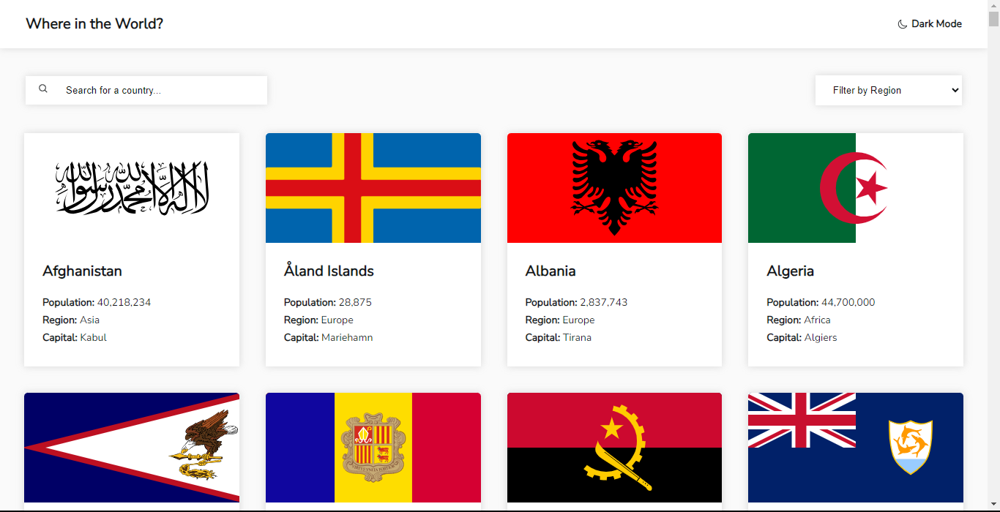
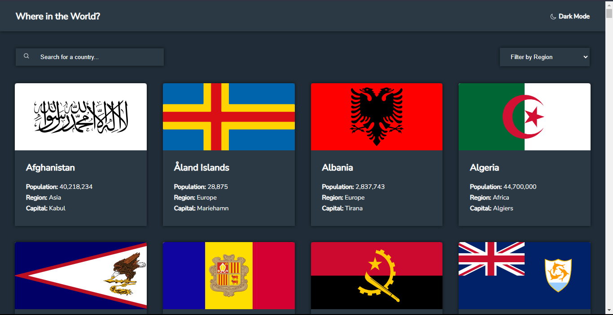
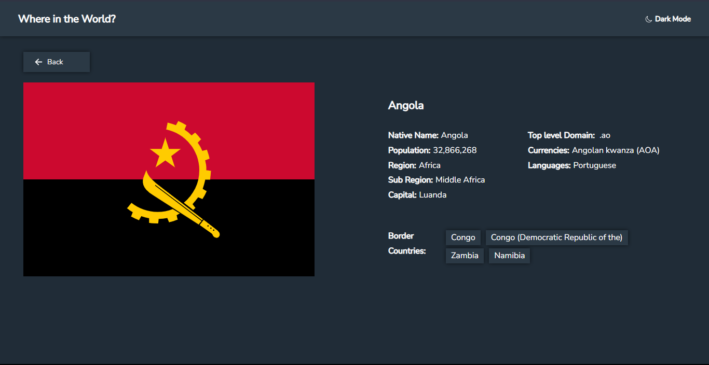

# Frontend Mentor - REST Countries API with color theme switcher solution

This is a solution to the [REST Countries API with color theme switcher challenge on Frontend Mentor](https://www.frontendmentor.io/challenges/rest-countries-api-with-color-theme-switcher-5cacc469fec04111f7b848ca). Frontend Mentor challenges help you improve your coding skills by building realistic projects.

## Table of contents

- [Overview](#overview)
  - [The challenge](#the-challenge)
  - [Screenshot](#screenshot)
  - [Links](#links)
- [My process](#my-process)
  - [Built with](#built-with)
  - [What I learned](#what-i-learned)
  - [Continued development](#continued-development)
  - [Useful resources](#useful-resources)
- [Author](#author)

## Overview

### The challenge

Users should be able to:

- See all countries from the API on the homepage
- Search for a country using an `input` field
- Filter countries by region
- Click on a country to see more detailed information on a separate page
- Click through to the border countries on the detail page
- Toggle the color scheme between light and dark mode _(optional)_

### Screenshot

### Links

- Solution URL: [Add solution URL here](https://your-solution-url.com)
- Live Site URL: [Add live site URL here](https://your-live-site-url.com)

## My process

### Built with

- Semantic HTML5 markup
- CSS custom properties
- Flexbox
- CSS Grid
- Desktop-first workflow
- Javascript

### What I learned

I gained valuable insights from this challenge. Initially, I was uncertain about how CSS Grid functions, but with the help of various YouTube resources, I acquired the skills to effectively navigate CSS Grid. Additionally, I learned how to retrieve data and present it on the frontend. Having previously worked on a project involving an API, I applied similar logic to address the requirements of this challenge.

Furthermore, I discovered the impressive capabilities of local storage, which, with a 5MB capacity, allows for a multitude of functionalities. I successfully employed local storage to implement the dark mode/light mode switch feature. In summary, this challenge provided me with a wealth of knowledge and new skills.

### Continued development

I will continue working on css grid layouts and also continue leveraging local storage more in future projects.

### Useful resources

- [Net Ninja's CSS grid tutorial](https://youtu.be/MDQG6LSS8l8?si=Jo2E581y0uIa9_yz) - Net Ninja on youtube helped me understand css grid layouts. I really liked his explanation and will be using his css grid tutorials going forward as I take on more layout challenges on frontend mentor.

- [Kevin Powell's dark mode light mode tutorial](https://youtu.be/wodWDIdV9BY?si=3_sm4cveXCkbJhno) - This is an amazing tutorial which helped me finally understand how to toggle between light mode and dark mode. I'd recommend it to anyone still learning this concept.

- [ChatGPT](https://chat.openai.com) - Incorporating AI into my workflow has unquestionably increased my productivity tenfold. I can now analyze intricate problems and devise solutions in half the time.

## Author

- Website - [Anthony Mwaura](https://github.com/Anthony11-hub)
- Frontend Mentor - [@Anthony11-hub](https://www.frontendmentor.io/profile/Anthony11-hub)
- Twitter - [@Anthony11hub](https://www.twitter.com/Anthony11hub)
